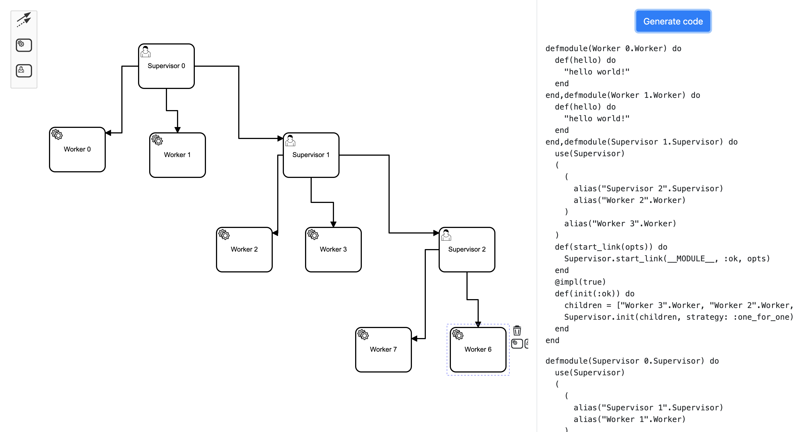

# Elixir Enterprise Edition

## Problem

As enterprise software architects you can not write any code. Your can only generate code based on uml diagrams. In order to attract enterprise software architects we decided to create tool for code generation based on simple uml diagrams.

## Solution

Fronted application is in [front](front]) folder. In order to start it please cd to it and run:

  * `npm install`
  * `npm start`

You can create tree of supervised workers using ui blocks. You can connect workers to supervisors and supervisors to supervisors. You cannot link workers to workers and any supervisor cannot be left alone as well as worker. In order to generate code please click `generate code`. Then created model is sent to backend and result is presented below button.

Important!

-No supervisor can be childless!

-You must start with supervisor!

You can add names to nodes - those will be included in generated code - all supervisors will have `name.Supervisor` and workers `name.Worker` module names.

Backend application is in [shamu](shamu]) folder. In order to start it please cd to it and run:

  * `mix deps.get`
  * `mix phx.server`

Backend app uses Elixir macros to generate code. It will receive a tree that was created in the Frontend and will transform it into the code.

## Plans
-Add possibility to generate code from commandline using local json file

-Add different kinds of workers

-Generate project structure

-Scaffold tests
